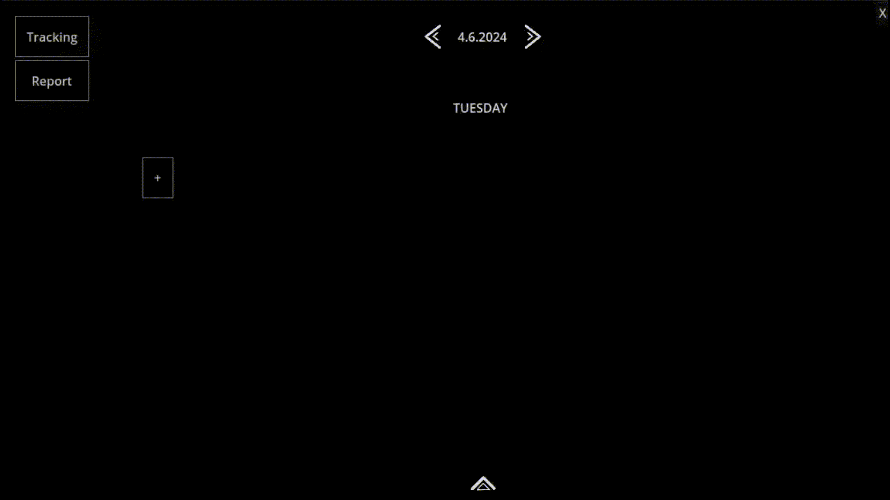

# SnapTracker
A time-tracking tool created in Godot.

SnapTracker was made to help you keep track of how long you have been working on certain tasks. Once you are done tracking, you can check all your tracked data in the report view.

All data is stored in the default app userdata path in an SQLite database (see https://docs.godotengine.org/en/stable/tutorials/io/data_paths.html).

You can import and export data to/from CSV.

## Tracking View

Here you can track your activities. You can:

* add new activities and give them arbitrary names
* start tracking an activity
* update the time you spent on an activity

There is also a compact view that you can pin in place, which will then always stay on top and display the activity currently being tracked.

## Report View

In the report view you'll get an overview of all your tracked activities.

You can jump back to arbitrary days or select an interval that you would like to look at. Given you have selected an interval, you can also view all tracked activities in a combined view.

Here you can also export csv data to a file or your clipboard. Select an interval and toggle "total" on if you want to export multiple days at once.

----------------------------------------------

## Build

This project requires Godot 4.3 to build.

Run `./build.sh` to build executables for Linux and Windows. The artifacts will be in `build/linux` for Linux and in `build/windows` for Windows.

You can pass "flatpak" to `build.sh` to use the Godot flatpak to build instead.
